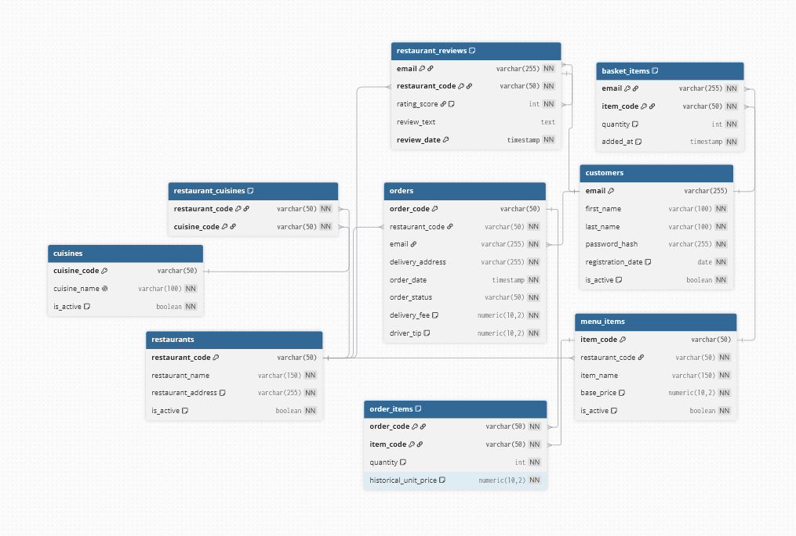
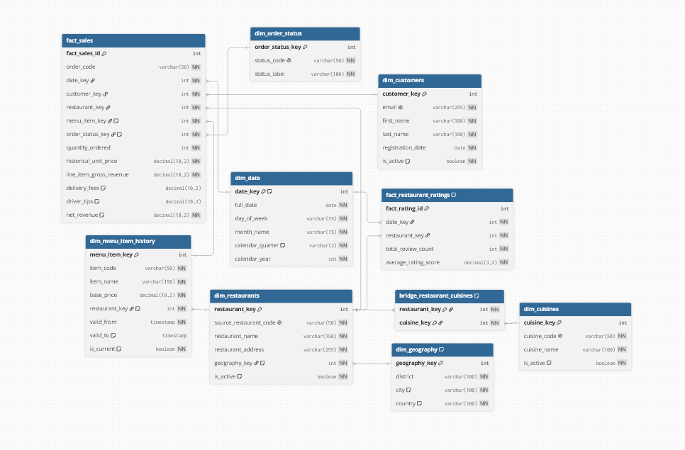

# Bookstore Course Work: Documentation

**Topic:** Food Delivery Platform (Vilnius, Lithuania)
**Stack:** PostgreSQL 18, Docker

---

## What This Project Is

A food delivery service: customers place orders, leave reviews.  
This project covers the full data layer: a normalized OLTP database for daily operations, and a data warehouse (OLAP) for analytics.

---

## 1. OLTP

The OLTP database (`delivery_oltp`) keeps all the operational data: restaurants, menus, customers, orders, basket contents, and reviews. It's 3NF, so nothing is duplicated.

**Main entities:**

- **cuisines**: list of cuisine types. Restaurants can serve cuisines: that's handled through `restaurant_cuisines`.
- **restaurants**: name and address. Soft-deleted with `is_active` flag instead of hard deletes.
- **restaurant_cuisines**: bridge table connecting restaurants to cuisines (many-to-many).
- **customers**: email as PK, hashed password, registration date. Also soft-deleted.
- **menu_items**: each item belongs to a restaurant, has a price. Price changes in the source data get tracked historically in the OLAP layer (SCD2 there, SCD1 here).
- **orders**: one row per order, links to customer and restaurant. Stores delivery address, status (Delivered or Cancelled), fee, and tip at order level.
- **order_items**: line items inside an order. Stores `historical_unit_price`: the price at the time of the order, not the current one. Composite PK: `(order_code, item_code)`.
- **basket_items**: what the customer currently has in cart, not yet ordered.
- **restaurant_reviews**: rating (1–5) and text per customer per restaurant. PK is `(email, restaurant_code, review_date)` so a customer can leave multiple reviews over time.

**Relationships:**



---

## 2. OLAP

The data warehouse (`delivery_olap`) is a snowflake schema. It's stored in a separate database, populated via ETL from OLTP.

**The main questions:**

- Which cuisine types bring the most revenue each month?
- Which districts have the most profitable restaurants and highest ratings?
- Did a menu item's price change affect how often it was ordered?

**Dimension tables:**

- **dim_date**: one row per day with date, weekday, month, quarter, year. Populated automatically from the date range of actual order data.
- **dim_customers**: SCD1, current customer info only.
- **dim_restaurants**: SCD1, linked to `dim_geography` for the Snowflake sub-dimension.
- **dim_geography**: districts of extracted from restaurant addresses (Senamiestis, Naujamiestis, etc.). Append-only, never updated.
- **dim_cuisines**: SCD1, same codes as OLTP.
- **dim_menu_item_history**: **SCD Type 2**. When a menu item's name or price changes, the old row gets a `valid_to` timestamp and a new row is created. This lets us match an order to the exact price version active at order time.
- **dim_order_status**: small lookup: Delivered / Cancelled.
- **bridge_restaurant_cuisines**: same many-to-many structure as OLTP, but using DWH keys. This is needed so fact queries can aggregate by cuisine.

**Fact tables:**

- **fact_sales**: one row per order line item. Delivery fee and driver tip are split proportionally across line items by revenue share (pro-rata). Tracks cancelled orders too.
- **fact_restaurant_ratings**: pre-aggregated: one row per (date, restaurant) with total review count and average rating.

**OLAP schema:**



---

## 3. Scripts: What to Run and In What Order

The project runs on Docker. Three containers: `oltp_db` (port 5432), `olap_db` (port 5433), and `pgadmin` (port 8080).

### Step 0: Start the containers

```bash
docker compose up -d
```

Wait a few seconds for Postgres to initialize.

### Step 1: Load data into OLTP

Run `LoadToOLTP.sql` on the `delivery_oltp` database (port 5432).

This script:
1. Creates all 9 OLTP tables + 5 staging tables (if they don't exist yet).
2. Loads raw CSV files from `/mnt/data/` (mounted from `initial_data_csv/`) into staging tables.
3. Upserts data from staging into the real tables: dimensions first, then facts.

The script is idempotent: running it multiple times is safe. Already-existing records won't be duplicated or overwritten unless the source data changed.

```sql
-- run in delivery_oltp
CALL run_oltp_pipeline();
```

The procedure `run_oltp_pipeline()` calls everything in order internally.

**CSV files used:**
| File | Loads into |
|------|-----------|
| `customers.csv` | `customers` |
| `menu_source.csv` | `restaurants`, `cuisines`, `restaurant_cuisines`, `menu_items` |
| `orders_source.csv` | `orders`, `order_items` |
| `baskets_source.csv` | `basket_items` |
| `reviews_source.csv` | `restaurant_reviews` |

### Step 2: Set up FDW connection (once)

Run `OLTPtoOLAP_link.sql` on the `delivery_olap` database (port 5433).

This sets up a Foreign Data Wrapper so the OLAP database can read from OLTP directly. Run this once: it doesn't need to be repeated unless the containers are recreated.

```sql
-- run in delivery_olap
-- just execute the whole script, it creates the fdw server and imports tables
```

### Step 3: Run ETL

Run `ETL.sql` on the `delivery_olap` database (port 5433).

This script:
1. Pulls fresh data from OLTP staging (via FDW).
2. Creates all DWH tables if missing.
3. Populates `dim_date` from the actual date range in the data.
4. Syncs all SCD1 dimensions (upsert / soft-delete).
5. Runs SCD2 logic on menu items: closes old versions, opens new ones if price or name changed.
6. Populates the bridge table.
7. Loads `fact_sales` with temporal SCD2 joins and pro-rata fee allocation.
8. Loads `fact_restaurant_ratings` with aggregated review data.

```sql
-- run in delivery_olap
CALL run_etls();
```

Also idempotent: new runs only add records that aren't there yet. Ratings recalculate if reviews were updated.

### Step 4: Run queries

- OLTP queries: run `queries_oltp.sql` on `delivery_oltp` (port 5432)
- OLAP queries: run `queries_olap.sql` on `delivery_olap` (port 5433)

### Step 5: Open the Power BI report

Open `Delivery_Report.pbix` in Power BI Desktop. In the Home tab, update the data source credentials to point to your local OLAP database (`localhost:5433`, database `delivery_olap`). Click **Refresh** to load current data.

A static export of the report is available in `Delivery_Report.pdf`.

---

## 4. Power BI Report (2 pages)

### Page 1: Results of 2 first months of business

An overview dashboard with KPI cards and district-level breakdowns.

- **Info cards** (top right): total revenue across all ordersand number of restaurants connected.
- **Total revenue in time** (line chart): daily revenue from `fact_sales` over full date range.
- **Customer ratings** (horizontal bar chart): average rating score per restaurant from `fact_restaurant_ratings`.
- **Restaurant slicer**: filters all visuals on the page to a selected restaurant.
- **Revenue by district** (pie chart): share of total revenue broken down by Vilnius district from `dim_geography`.
- **Number of orders by district** (pie chart): order count distribution across districts.

### Page 2: Revenue distribution overview

A breakdown by cuisine type, restaurant and weekday.

- **Revenue by cuisine** (matrix table): `net_revenue` cross-tabulated by month and cuisine type, drilled down to individual order dates.
- **Restaurants total revenue by month** (matrix table): per-restaurant revenue split by May and June.
- **Revenue by cuisine** (treemap): visual proportions of total revenue by cuisine.
- **District slicer**: filters all visuals on the page to a selected district.
- **Revenue by week day** (line chart): total revenue aggregated by day of week.

---

## 5. Key Design Decisions Worth Mentioning

- **No surrogate keys in source CSV**: natural keys (email, item_code, restaurant_code, etc.) are used as primary keys in OLTP.
- **SCD2 on menu items**: price changes are versioned so historical orders always link to the right price.
- **Pro-rata fee allocation**: since delivery fee and tip are per-order, they get split across line items proportionally. This keeps per-item metrics meaningful.
- **Separate databases**: OLTP and OLAP run in different Postgres instances. The ETL connects them via FDW, not by running in the same DB.
- **Soft deletes**: customers and restaurants are never hard-deleted. Removed records get `is_active = false`.
